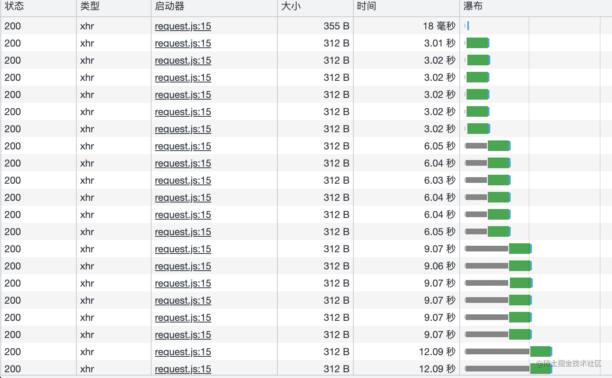

# 大文件断点续传

**思路：通过file.slice方法对大文件进行切割，利用spark-md5.js计算文件唯一的hash值，点击开始上传，发送文件的hash值给服务端，服务端返回是否需要上传以及已经上传过的区块号码（hash+分割时的下标），根据服务端返回，若需要上传则过滤掉已经上传的区块继续上传余下的区块，若不需要上传则表示已经上传过，实现秒传的效果。**

## Blob对象

Blob对象自带属性

1. size 表示二进制对象的大小
2. type 表示二进制对象的类型 (如果是File对象分割的,会继承type属性)
3. slice方法分割文件

## File 对象

File对象是特殊类型的 Blob，它继承了 Blob 对象，或者说是一种特殊的 Blob 对象，所有可以使用 Blob 对象的场合都可以使用它。

因此可以使用 Blob 的实例方法`slice()`。

## spark-md5

[spark-md5.js](https://github.com/satazor/js-spark-md5)号称是最适合前端最快的算法，能快速计算文件的md5。

spark-md5提供了两个计算md5的方法。一种是用`SparkMD5.hashBinary()` 直接将整个文件的二进制码传入，直接返回文件的md5。这种方法对于小文件会比较有优势——简单而且速度超快。

另一种方法是利用js中File对象的`slice()`方法（`File.prototype.slice`）将文件分片后逐个传入`spark.appendBinary()`方法来计算、最后通过`spark.end()`方法输出md5。这种方法对于大文件和超大文件会非常有利，不容易出错，不占用大内存，并且能够提供计算的进度信息。

以上两种方法在[spark-md5.js](https://github.com/satazor/js-spark-md5)项目主页都有实例代码

MD5: 信息摘要算法（英语：MD5 Message-Digest Algorithm)，一种被广泛使用的密码散列函数，可以产生出一个128位（16字节）的散列值（hash value），用于确保信息传输完整一致

MD5本身是一个算法函数，而输入**由文件本身的内容决定**的，即二进制流，与文件名、创建时间等等因素无关。

## 大文件断点续传流程

我们先来理理文件上传流程。

1. 点击上传按钮，选择要上传的文件。
2. 文件分片
3. 点击开始上传，计算文件hash值，避免文件名修改后上传，验证文件是否存在，过滤已存在的区块
4. 将分片一个个上传给后端
5. 全部分片上传完成后，前端告诉后端可以**合并文件**了。
6. 后端合并文件。
7. 完成上传。


### 代码实现

```jsx
// upload.js 文件上传组件

import React, { useState, useEffect, useMemo } from "react";
import request from "./utils/request";
import styled from "styled-components";
import hashWorker from "./utils/hash-worker";
import WorkerBuilder from "./utils/worker-build";

const CHUNK_SIZE = 500; // 用于设置分片大小

const UpLoadFile = function () {
  const [fileName, setFileName] = useState("");
  const [fileHash, setFileHash] = useState("")
  const [chunkList, setChunkList] = useState([])
  const [hashPercentage, setHashPercentage] = useState(0)

  // 获取文件后缀名
  const getFileSuffix = (fileName) => {
    let arr = fileName.split(".");
    if (arr.length > 0) {
      return arr[arr.length - 1]
    }
    return "";
  }

  // 2.文件分片
  const splitFile = (file, size = CHUNK_SIZE) => {
    const fileChunkList = [];
    let curChunkIndex = 0;
    while (curChunkIndex <= file.size) {
      const chunk = file.slice(curChunkIndex, curChunkIndex + size);//Blob.slice方法分割文件
      fileChunkList.push({ chunk: chunk, })
      curChunkIndex += size;
    }
    return fileChunkList;
  }
  // 1.选择文件
  const handleFileChange = (e) => {
    const { files } = e.target;
    if (files.length === 0) return;
    setFileName(files[0].name);// 保存文件名
    const chunkList = splitFile(files[0])// 文件分片
    setChunkList(chunkList);
  }

  // 5.发送合并请求
  const mergeRequest = (hash) => {
    request({
      url: "http://localhost:3001/merge",
      method: "post",
      headers: {
        "content-type": "application/json"
      },
      data: JSON.stringify({
        fileHash: hash,// 服务器存储的文件名：hash+文件后缀名
        suffix: getFileSuffix(fileName),
        size: CHUNK_SIZE// 用于服务器合并文件
      })
    })
  }
  // 4.上传分片
  const uploadChunks = async (chunksData, hash) => {
    const formDataList = chunksData.map(({ chunk, hash }) => {
      const formData = new FormData()
      formData.append("chunk", chunk);
      formData.append("hash", hash);
      formData.append("suffix", getFileSuffix(fileName));
      return { formData };
    })

    const requestList = formDataList.map(({ formData }, index) => {
      return request({
        url: "http://localhost:3001/upload",
        data: formData,
        onprogress: e => {
          let list = [...chunksData];
          list[index].progress = parseInt(String((e.loaded / e.total) * 100));
          setChunkList(list)
        }
      })
    })
    
    Promise.all(requestList).then(() => { // 上传文件
      
      setTimeout(() => {
        mergeRequest(hash);// 分片全部上传后发送合并请求
      }, 1000);

    })
  }
  // 计算文件hash
  const calculateHash = (chunkList) => {
    return new Promise(resolve => {
      const woker = new WorkerBuilder(hashWorker)
      console.log('主线程创建worker计算hash值',woker)
      woker.postMessage({ chunkList: chunkList })
      woker.onmessage = e => {
        console.log('主线程接收worker发来的信息 ',e)
        const { percentage, hash } = e.data;
        setHashPercentage(percentage);
        if (hash) {
          // 当hash计算完成时，执行resolve
          resolve(hash)
        }
      }
    })
  }
  // 3.上传文件
  const handleUpload = async (e) => {
    if (!fileName) {
      alert("请先选择文件")
      return;
    }
    if (chunkList.length === 0) {
      alert("文件拆分中，请稍后...")
      return;
    }
    
    const hash = await calculateHash(chunkList)// 计算hash
    setFileHash(hash)
    const { shouldUpload, uploadedChunkList } = await verfileIsExist(hash, getFileSuffix(fileName));//验证文件是否存在服务器
    if (!shouldUpload) {
      alert("文件已存在，无需重复上传");
      return;
    }
    let uploadedChunkIndexList = [];
    if (uploadedChunkList && uploadedChunkList.length > 0) {
      uploadedChunkIndexList = uploadedChunkList.map(item => {
        const arr = item.split("-");
        return parseInt(arr[arr.length - 1])
      })
      alert("已上传的区块号：" + uploadedChunkIndexList.toString())
    }
    const chunksData = chunkList.map(({ chunk }, index) => ({
      chunk: chunk,
      hash: hash + "-" + index,
      progress: 0
    })).filter(item2 => {
      const arr = item2.hash.split("-")// 过滤掉已上传的块
      return uploadedChunkIndexList.indexOf(parseInt(arr[arr.length - 1])) === -1;
    })
    
    setChunkList(chunksData)// 保存分片数据
    
    uploadChunks(chunksData, hash)// 开始上传分片
  }

  // 验证文件是否存在服务器
  const verfileIsExist = async (fileHash, suffix) => {
    const { data } = await request({
      url: "http://localhost:3001/verFileIsExist",
      headers: {
        "content-type": "application/json"
      },
      data: JSON.stringify({
        fileHash: fileHash,
        suffix: suffix
      })
    })
    return JSON.parse(data);
  }

  return (
    <div>
      <input type="file" onChange={handleFileChange} /><br />
      <button onClick={handleUpload}>上传</button>
      <ProgressBox chunkList={chunkList} />
    </div>
  )
}
const BlockWraper = styled.div`
  width: ${({ size }) => size + "px"};
  height: ${({ size }) => size + "px"};
  text-align: center;
  font-size: 12px;
  line-height: ${({ size }) => size + "px"}; 
  border: 1px solid #ccc;
  position: relative;
  float: left;
  &:before {
    content: "${({ chunkIndex }) => chunkIndex}";
    position: absolute;
    width: 100%;
    height: 10px;
    left: 0;
    top: 0;
    font-size: 12px;
    text-align: left;
    line-height: initial;
    color: #000
  }
  &:after {
    content: "";
    position: absolute;
    width: 100%;
    height: ${({ progress }) => progress + "%"};
    background-color: pink;
    left: 0;
    top: 0;
    z-index: -1;
  }
`
const ChunksProgress = styled.div`
  *zoom: 1;
  &:after {
    content: "";
    display: block;
    clear: both;
  }
`
const Label = styled.h3``
const ProgressWraper = styled.div``
const Block = ({ progress, size, chunkIndex }) => {
  return (<BlockWraper size={size} chunkIndex={chunkIndex} progress={progress}>
    {progress}%
  </BlockWraper>)
}

const ProgressBox = ({ chunkList = [], size = 40 }) => {
  const sumProgress = useMemo(() => {
    if (chunkList.length === 0) return 0
    return chunkList.reduce((pre, cur, sum) => pre + cur.progress / 100, 0) * 100 / (chunkList.length)
  }, [chunkList])

  return (
    <ProgressWraper>
      <Label>文件切分为{chunkList.length}段，每段上传进度如下：</Label>
      <ChunksProgress>
        {chunkList.map(({ progress }, index) => (
          <Block key={index} size={size} chunkIndex={index} progress={progress} />
        ))}
      </ChunksProgress>
      <Label>总进度:{sumProgress.toFixed(2)}%</Label>
    </ProgressWraper >
  )
}

export default UpLoadFile;

```

```js
// utils/hash-worker.js
const hashWorker = () => {
  self.importScripts("http://localhost:3000/spark-md5.min.js")
  self.onmessage = (e) => {
    const { chunkList } = e.data;
    const spark = new self.SparkMD5.ArrayBuffer();
    let percentage = 0;
    let count = 0;
    const loadNext = index => {
      const reader = new FileReader();
      reader.readAsArrayBuffer(chunkList[index].chunk);
      reader.onload = event => {
        count++;
        spark.append(event.target.result);
        if (count === chunkList.length) {
          self.postMessage({
            percentage: 100,
            hash: spark.end()
          })
          self.close();
        } else {
          percentage += (100 / chunkList.length)
          self.postMessage({
            percentage
          })
          loadNext(count)
        }
      }
    }
    loadNext(count)
  }
}

export default hashWorker

```

```js
// utils/worker-build.js
export default class WorkerBuilder extends Worker {
    constructor(worker) {
      const code = worker.toString();
      const blob = new Blob([`(${code})()`]);
      return new Worker(URL.createObjectURL(blob));
    }
  }
  
```

```js
// utils/request.js
const request = ({
    url,
    method = "post",
    data,
    headers = {},
    onprogress
  }) => {
    return new Promise(resolve => {
      const xhr = new XMLHttpRequest();
      xhr.open(method, url);
      Object.keys(headers).forEach(key =>
        xhr.setRequestHeader(key, headers[key])
      );
      xhr.upload.onprogress = onprogress
      xhr.send(data);
      xhr.onload = e => {
        resolve({
          data: e.target.response
        });
      };
    });
  }
  
  export default request;
  
```

express服务

```js
const multiparty = require("multiparty");
const bodyParser = require("body-parser");
const express = require('express')
const path = require('path')
const fse = require("fs-extra")

let app = express()
const DirName = path.resolve(path.dirname(''));
const UPLOAD_FILES_DIR = path.resolve(DirName, "./filelist")
// 配置请求参数解析器
const jsonParser = bodyParser.json({ extended: false });
// 配置跨域
app.use(function (req, res, next) {
  res.setHeader("Access-Control-Allow-Origin", "*");
  res.setHeader("Access-Control-Allow-Headers", "*");
  next()
})
// 获取已上传的文件列表
const getUploadedChunkList = async (fileHash) => {
  const isExist = fse.existsSync(path.resolve(UPLOAD_FILES_DIR, fileHash))
  if (isExist) {
    return await fse.readdir(path.resolve(UPLOAD_FILES_DIR, fileHash))
  }
  return []
}

app.post('/verFileIsExist', jsonParser, async (req, res) => {
  const { fileHash, suffix } = req.body;
  const filePath = path.resolve(UPLOAD_FILES_DIR, fileHash + "." + suffix);
  if (fse.existsSync(filePath)) {
    res.send({
      code: 200,
      shouldUpload: false
    })
    return;
  }
  const list = await getUploadedChunkList(fileHash);
  if (list.length > 0) {
    res.send({
      code: 200,
      shouldUpload: true,
      uploadedChunkList: list
    })
    return;
  }
  res.send({
    code: 200,
    shouldUpload: true,
    uploadedChunkList: []
  })
})

app.post('/upload', async (req, res) => {
  const multipart = new multiparty.Form();
  multipart.parse(req, async (err, fields, files) => {
    if (err) return;
    const [chunk] = files.chunk;
    const [hash] = fields.hash;
    const [suffix] = fields.suffix;
    // 注意这里的hash包含文件的hash和块的索引，所以需要使用split切分
    const chunksDir = path.resolve(UPLOAD_FILES_DIR, hash.split("-")[0]);
    if (!fse.existsSync(chunksDir)) {
      await fse.mkdirs(chunksDir);
    }
    await fse.move(chunk.path, chunksDir + "/" + hash);
  })
  res.status(200).send("received file chunk")
})

const pipeStream = (path, writeStream) =>
  new Promise(resolve => {
    const readStream = fse.createReadStream(path);
    readStream.on("end", () => {
      fse.unlinkSync(path);
      resolve();
    });
    readStream.pipe(writeStream);
  });

// 合并切片
const mergeFileChunk = async (filePath, fileHash, size) => {
  const chunksDir = path.resolve(UPLOAD_FILES_DIR, fileHash);
  const chunkPaths = await fse.readdir(chunksDir);
  chunkPaths.sort((a, b) => a.split("-")[1] - b.split("-")[1]);
  console.log("指定位置创建可写流", filePath);
  await Promise.all(
    chunkPaths.map((chunkPath, index) =>
      pipeStream(
        path.resolve(chunksDir, chunkPath),
        // 指定位置创建可写流
        fse.createWriteStream(filePath, {
          start: index * size,
          end: (index + 1) * size
        })
      )
    )
  );
  // 合并后删除保存切片的目录
  fse.rmdirSync(chunksDir);
};

app.post('/merge', jsonParser, async (req, res) => {
  const { fileHash, suffix, size } = req.body;
  const filePath = path.resolve(UPLOAD_FILES_DIR, fileHash + "." + suffix);
  await mergeFileChunk(filePath, fileHash, size);
  res.send({
    code: 200,
    message: "success"
  });
})

app.listen(3001, () => {
  console.log('listen:3001')
})

```

**断点续传这部分当时看了某位大佬的文章，本来想直接贴链接，但是实在找不到原文了，原文作者如果看到麻烦踢我一下~~~**

# 针对大文件上传的追问

## 如何进行并行上传（更快）

> 或者也可以问：
> 
> - 文件切割后如何上传
> 
> - 如何提升上传效率

不同浏览器在同一域名下并发请求数量限制在2-8个。当请求的数量超过2-8个后就会阻塞。

以谷歌为例，浏览器并发请求设置在6个：



所以我们可以根据浏览器的特性，对分片后的数据进行一个并发请求。

但是这会存在一个问题：如果实际的接口响应时间很慢，同时请求大量接口，对于后面pending的接口而言，存在超时风险。

解决办法就是：控制并发请求数量。以谷歌为例，每次只发起6个请求，每当6个请求中有一个请求完成后，就添加一个请求：


```
// 模拟接口
function fetchFn(url) {
    console.log(url);
    return new Promise((resolve, reject) => {
        setTimeout(() => {
            if (url % 2 || typeof url === 'string') {
                resolve({ success: 1, data: url })
            } else {
                reject({ success: 0, data: url })
            }
        }, 3000)
    })
}
const urls = [1, 2, 3, 4, 5, 6, 7, 8, 9]
​
​
const concurrencyRequest = (urls, maxNum) => {
    return new Promise((resolve) => {
        if (urls.length === 0) {
            resolve([]);
            return;
        }
        const results = [];
        let index = 0; // 下一个请求的下标
        let count = 0; // 当前请求完成的数量
​
        // 发送请求
        async function request() {
            if (index === urls.length) return;
            const i = index; // 保存序号，使result和urls相对应
            const url = urls[index];
            index++;
            try {
                const resp = await fetchFn(url);
                // resp 加入到results
                console.log(`${resp.data}-请求成功`)
                results[i] = resp;
            } catch (err) {
                // err 加入到results
                console.log(`${err.data}-请求失败`)
                // 请求失败的数据重新请求
                urls.push(err.data + '') //避免第二次请求失败
                results[i] = err;
            } finally {
                count++;
                // 判断是否所有的请求都已完成
                if (count === urls.length) {
                    console.log('完成了');
                    resolve(results);
                }
                request();
            }
        }
​
        // maxNum和urls.length取最小进行调用
        const times = Math.min(maxNum, urls.length);
        for (let i = 0; i < times; i++) {
            request();
        }
    })
}
​
concurrencyRequest(urls, 3)
```

还有一种方案是Promise.all+Promise.race+reduce实现的(可以看我视频)

### 浏览器为什么限制并发请求数量

-   对操作系统端口资源考虑

PC总端口数为65536，那么一个TCP（http也是tcp）链接就占用一个端口。操作系统通常会对总端口一半开放对外请求，以防端口数量不被迅速消耗殆尽。

-   过多并发导致频繁切换产生性能问题

一个线程对应处理一个http请求，那么如果并发数量巨大的话会导致线程频繁切换。而线程的上下文切换有时候并不是轻量级的资源。这导致得不偿失，所以请求控制器里面会产生一个链接池，以复用之前的链接。所以我们可以看作同域名下链接池最大为4～8个，如果链接池全部被使用会阻塞后面请求任务，等待有空闲链接时执行后续任务。

-   避免同一客服端并发大量请求超过服务端的并发阈值

在服务端通常都对同一个客户端来源设置并发阀值避免恶意攻击，如果浏览器不对同一域名做并发限制可能会导致超过服务端的并发阀值被BAN掉。

-   客户端良知机制

为了防止两个应用抢占资源时候导致强势一方无限制的获取资源导致弱势一方永远阻塞状态。

## 某个切片上传失败怎么办

1.  针对前边使用for循环进行并发请求（concurrencyRequest）的方法，可以在catch中将失败的请求再一次添加到urls中。


2.  针对Promise.all+Promise.race+reduce实现方案中：

    Promise.all(tasksArr).then().catch() 会在所有tasksArr都resolve时才会进then方法，并且把所有结果以一个数组返回。

    ```
    function p(val){
        return function(){
            return new Promise((resolve,reject)=>{
                setTimeout(()=>{
                    resolve(val)
                },1000)
            })
        }
    }
    ​
    let p1=p(1)
    let p2=p(2)
    let p3=p(3)
    ​
    Promise.all([p1(),p2(),p3()]).then(res=>{
        console.log('返回值',res)//[ 1, 2, 3 ]
    })
    ```

    只要有一个失败，就会进catch。

    ```
    function p(val) {
        return function () {
            return new Promise((resolve, reject) => {
                setTimeout(() => {
                    if (val % 2) {
                        resolve(val)
                    } else {
                        reject(val)
                    }
                }, 1000)
            })
        }
    }
    ​
    let p1 = p(1)
    let p2 = p(2)
    let p3 = p(3)
    let p4 = p(4)
    ​
    ​
    Promise.all([p1(), p2(), p3(), p4()]).then(res => {
        console.log('返回值', res)//[ 1, 2, 3 ]
    }).catch(err => {
        console.log('某个promise失败', err)//某个promise失败 2
    })
    ```

    但如果在单个请求中定义了catch方法，就不会进Promise.all的catch方法:

    ```
    function p(val) {
        return function () {
            return new Promise((resolve, reject) => {
                setTimeout(() => {
                    if (val % 2) {
                        resolve(val)
                    } else {
                        reject(val)
                    }
                }, 1000)
            }).then(res => {
                console.log('单个promise中的then', res)
            }).catch(err => {
                console.log('单个promise中的catch', err)
            })
        }
    }
    ​
    let p1 = p(1)
    let p2 = p(2)
    let p3 = p(3)
    let p4 = p(4)
    ​
    ​
    Promise.all([p1(), p2(), p3(), p4()]).then(res => {
        console.log('all中的then', res)
    }).catch(err => {
        console.log('all中的catch', err)
    })
    ​
    /**
    单个promise中的then 1
    单个promise中的catch 2
    单个promise中的then 3
    单个promise中的catch 4
    all中的then [ undefined, undefined, undefined, undefined ]
     */
    ```

    因此，可以在单个的catch中将失败的promise放入一个list，待一轮请求完成后，再去请求失败的请求。

    ```
    function p(val) {
        return function () {
            return new Promise((resolve, reject) => {
                setTimeout(() => {
                    if (val % 2) {
                        resolve(val)
                    } else {
                        reject(val)
                    }
                }, 1000)
            }).catch(err => {
                // doSomething:将失败的请求添加进list，以便后续再次请求
                console.log('单个promise中的catch', err)
            })
        }
    }
    ​
    let p1 = p(1)
    let p2 = p(2)
    let p3 = p(3)
    let p4 = p(4)
    ​
    ​
    Promise.all([p1(), p2(), p3(), p4()]).then(res => {
        console.log('all中的then', res)
    }).catch(err => {
        console.log('all中的catch', err)
    })
    ​
    /**
    单个promise中的catch 2
    单个promise中的catch 4
    all中的then [ 1, undefined, 3, undefined ]
     */
    ```

## 规定了切片的数量如何切割

通过file.size获取文件的大小，然后根据切片数量(nums)计算出每个分片的大小(file.size/nums)后进行切割。

## 规定切片大小如何分割

通过curChunkIndex记录当前分割进度：

-   curChunkIndex初始化为0
-   file.slice(curChunkIndex, curChunkIndex + size)对文件进行分割
-   每次分割完成后将分片添加进数组中，curChunkIndex+=size
-   当curChunkIndex>size的时候即分割完成

## 如何实现秒传

上传文件时，利用spark-md5.js根据文件内容生成唯一的hash值（只要文件内容不变，hash值就不变），上传前发送请求判断该文件是否上传过，若已经上传过则不再重新上传，实现秒传功能。

## 上传过程中刷新页面怎么办

上传过程中刷新我理解存在两种情况：

-   用户误操作导致的刷新
-   没有暂停上传或者取消上传的按钮，用户想通过刷新停止当前上传

针对上处两种情况，可以监听刷新（或者离开）事件：会提醒用户是否执行刷新操作，是否停止上传选择权交给用户

```
window.addEventListener("beforeunload", function (event) {
  event.returnValue = ""
});
```

## 有没有实现中断上传

这里面试官指的是终止已经发送的请求。

### 终止 `fetch` 请求

[AbortController](https://link.juejin.cn?target=https%3A%2F%2Fdeveloper.mozilla.org%2Fzh-CN%2Fdocs%2FWeb%2FAPI%2FAbortController "https://developer.mozilla.org/zh-CN/docs/Web/API/AbortController") 接口表示一个控制器对象，可以根据需要终止一个或多个Web请求。

-   **AbortController()** ： AbortController()构造函数创建一个新的 AbortController 对象实例
-   **signal**：signal 属性返回一个 AbortSignal 对象实例，它可以用来 with/about 一个Web(网络)请求
-   **abort()** ：终止一个尚未完成的Web(网络)请求，它能够终止 fetch 请求，任何响应Body的消费者和流

下边例子中：首先我们使用 AbortController() 构造函数创建一个控制器，然后使用 AbortController.signal 属性获取其关联 AbortSignal 对象的引用。当一个 fetch request 初始化时，我们把 AbortSignal 作为一个选项传递到请求对象 (如下：{signal}) 。这将信号和控制器与获取请求相关联，然后允许我们通过调用 AbortController.abort() 中止请求。

```js
let controller;
const url = 'video.mp4';

const downloadBtn = document.querySelector('.download');
const abortBtn = document.querySelector('.abort');

downloadBtn.addEventListener('click', fetchVideo);

abortBtn.addEventListener('click', () => {
  if (controller) {
    controller.abort();
    console.log('中止下载');
  }
});

function fetchVideo() {
  controller = new AbortController();
  const signal = controller.signal;
  fetch(url, { signal })
    .then((response) => {
      console.log('下载完成', response);
    })
    .catch((err) => {
      console.error(`下载错误：${err.message}`);
    });
}

```

### 中断 `axios` 请求
使用 CancelToken.souce 工厂方法创建一个 cancel token，代码如下：

```js
const CancelToken = axios.CancelToken;
const source = CancelToken.source();

axios.get('https://mdn.github.io/dom-examples/abort-api/sintel.mp4', {
  cancelToken: source.token
}).catch(function (thrown) {
  // 判断请求是否已中止
  if (axios.isCancel(thrown)) {
    // 参数 thrown 是自定义的信息
    console.log('Request canceled', thrown.message);
  } else {
    // 处理错误
  }
});

// 取消请求（message 参数是可选的）
source.cancel('Operation canceled by the user.');
```
## 大文件上传如何结合 Web Work 处理大文件上传

### web Worker的使用

通过构造函数创建一个worker对象，构造函数接受一个 JavaScript 文件 URL —— 这个文件包含了将在 worker 线程中运行的代码。

Worker 运行在不同于当前 window 的另一个上下文中。这个上下文由一个对象表示，标准情况下为[`DedicatedWorkerGlobalScope`](https://developer.mozilla.org/zh-CN/docs/Web/API/DedicatedWorkerGlobalScope) 。

主线程和 worker 线程相互之间使用 `postMessage()` 方法来发送信息，并且通过 `onmessage` 这个 event handler 来接收信息（传递的信息包含在 [`message`](https://developer.mozilla.org/zh-CN/docs/Web/API/BroadcastChannel/message_event) 这个事件的`data`属性内) 。数据的交互方式为传递副本，而不是直接共享数据。

worker 可以另外生成新的 worker（目前只有 Firefox 浏览器支持），这些 worker 与它们父页面的宿主相同。

Worker 线程一旦新建成功，就会始终运行，不会被主线程上的活动（比如用户点击按钮、提交表单）打断。这样有利于随时响应主线程的通信。但是，这也造成了 Worker 比较耗费资源，不应该过度使用，而且一旦使用完毕，就应该关闭。

Web Worker 有以下几个使用注意点：

1.  **同源限制**：分配给 Worker 线程运行的脚本文件，必须与主线程的脚本文件同源。

<!---->

2.  **DOM 限制**：Worker 线程所在的全局对象，与主线程不一样，无法读取主线程所在网页的 DOM 对象，也无法使用`document`、`window`、`parent`这些对象。但是，Worker 线程可以`navigator`对象和`location`对象。

<!---->

3.  **通信联系**：Worker 线程和主线程不在同一个上下文环境，它们不能直接通信，必须通过消息完成。
3.  **脚本限制**：Worker 线程不能执行`alert()`方法和`confirm()`方法，但可以使用 XMLHttpRequest 对象发出 AJAX 请求。
3.  **文件限制**：Worker 线程无法读取本地文件，即不能打开本机的文件系统（`file://`），它所加载的脚本，必须来自网络。


### Web Worker在处理大文件中的作用：

在文件hash值计算的时候使用Web Worker 多任务进行计算，避免造成浏览器卡顿：

```js
import hashWorker from "./utils/hash-worker";
import WorkerBuilder from "./utils/worker-build";
​
// 计算文件hash
  const calculateHash = (chunkList) => {
    return new Promise(resolve => {
      const woker = new WorkerBuilder(hashWorker)
      console.log('主线程创建worker计算hash值',woker)
      woker.postMessage({ chunkList: chunkList })
      woker.onmessage = e => {
        console.log('主线程接收worker发来的信息 ',e)
        const { percentage, hash } = e.data;
        setHashPercentage(percentage);
        if (hash) {
          // 当hash计算完成时，执行resolve
          resolve(hash)
        }
      }
    })
  }
```

借助Blob创建worker：具体可参考[这里](https://hijiangtao.github.io/2019/03/21/Create-A-Dynamic-Web-Worker-With-Blob/)和[这里](https://juejin.cn/post/6844903543401349128)

```js
// worker-build.js
export default class WorkerBuilder extends Worker {
    constructor(worker) {
      const code = worker.toString();
      const blob = new Blob([`(${code})()`]);
      return new Worker(URL.createObjectURL(blob));
    }
  }
   
```

worker计算hash值：

```js
// hash-worker.js
const hashWorker = () => {
  self.importScripts("http://localhost:3000/spark-md5.min.js") // 此文件去https://github.com/satazor/js-spark-md5 下载下来放到public文件夹中
  self.onmessage = (e) => {
    console.log('worker线程接收消息',e)
    const { chunkList } = e.data;
    const spark = new self.SparkMD5.ArrayBuffer();
    let percentage = 0;
    let count = 0;
    const loadNext = index => {
      const reader = new FileReader();
      reader.readAsArrayBuffer(chunkList[index].chunk);
      reader.onload = event => {
        count++;
        spark.append(event.target.result);
        if (count === chunkList.length) {
          self.postMessage({
            percentage: 100,
            hash: spark.end()
          })
          self.close();
        } else {
          percentage += (100 / chunkList.length)
          self.postMessage({
            percentage
          })
          loadNext(count)
        }
      }
    }
    loadNext(count)
  }
}
​
export default hashWorker
​
​
```

##  相关代码：
https://gitee.com/sohucw/big-file-uplaod-face (非训练营学员禁止外传)

**有什么问题可以加我微信：baidudw**


