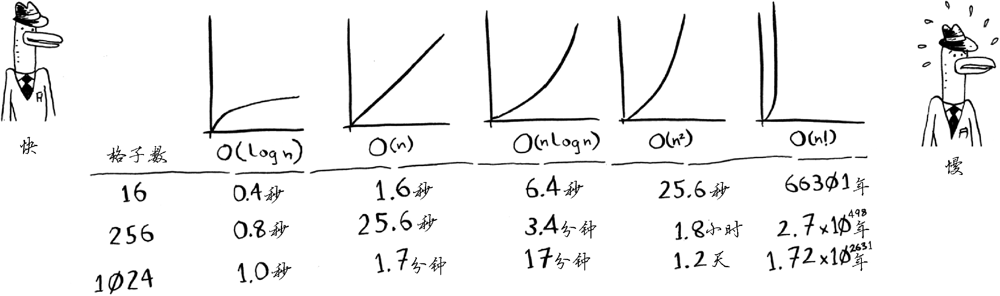
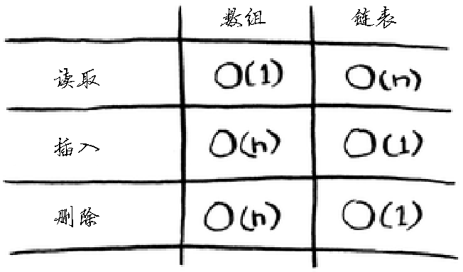
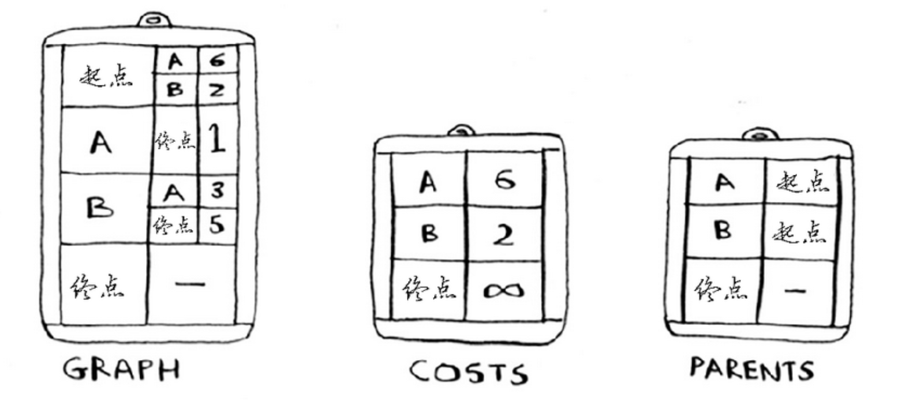
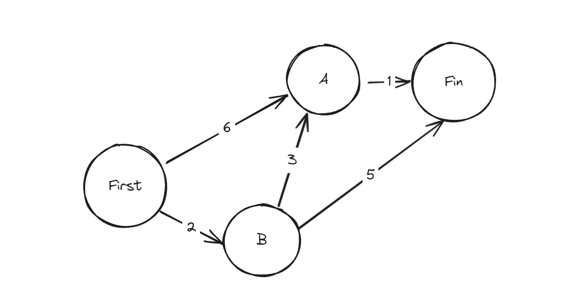
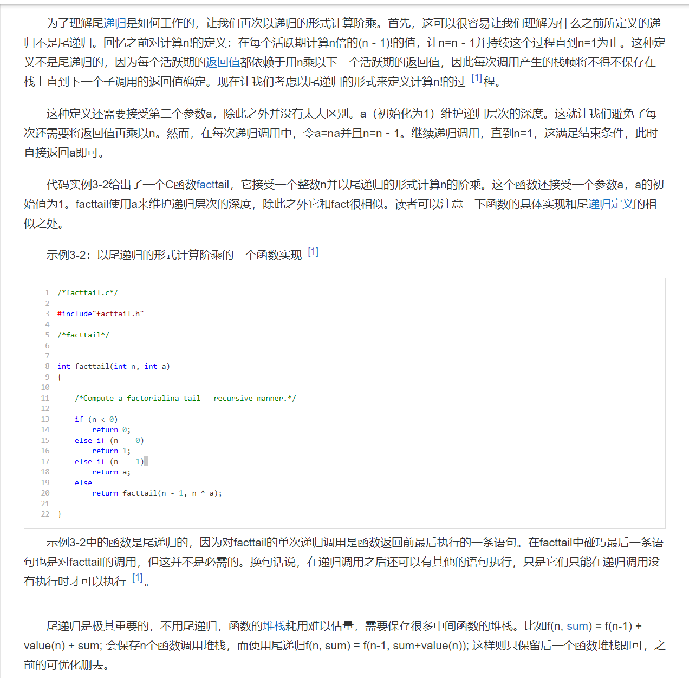

### 1:元素偏移量T - scrollTop <= clientHeight
- 元素偏移量T - scrollTop <= clientHeight
- 注意点： offsetTop 的值是 元素到父节点的偏移高度，所以要求到整个页面顶部的偏移量还需要借助while循环获取offsetParent来实现

```javascript
getTop(img) {
  let T = img.offsetTop
  while(img = img.offsetParent) {
    T += img.offsetTop
  }
  return T
}

scrollTop = document.documentElement.clientTop || document.body.clientTop
clientHeight: 可视区高度
```

### 2:getBoundingClientRect
- 可以直接通过getBoundingClientRect元素获取到元素跟可视区的相对位置
- 所以直接判断top 值和 clientHeight 的大小，当 top <= clientHeight时，说明，元素出现在可视区
```javascript
function isInVisiblePlace(img) {
  const {top, bottom, left, right} = img.getBoundingClientRect()

  const clientHeight = window.innerHeight

  return top <= clientHeight
}
```

### 3:Vue中的插件
- vue-lazyload
```javascript
// main.js 文件
import VueLazyload from 'vue-lazyload'
// Vue.use(VueLazyload) //无配置项
// 配置项
const loadimage = require('assets/img/common/loading.gif')
// const errorimage = require('assets/img/common/error.gif')
Vue.use(VueLazyload, {
  preLoad: 1.3, //预加载的宽高比
  loading: loadimage, //图片加载状态下显示的图片
  // error: errorimage, //图片加载失败时显示的图片
  attempt: 1, // 加载错误后最大尝试次数
})
// img元素上使用v-lazy="src";

```
### 4:指令实现lazyload
- v-lazy
```javascript
Vue.directive('VLazay', {
  bind: function(el, binding) {
    let lazyImageObserver = new IntersectionObserver((entries, observer) => {
        entries.forEach((entry, index) => {
            let lazyImage = entry.target;
            // 相交率，默认是相对于浏览器视窗
            if(entry.intersectionRatio > 0) {
                lazyImage.src = binding.value;
                // 当前图片加载完之后需要去掉监听
                lazyImageObserver.unobserve(lazyImage);
            }

        })
    })
    lazyImageObserver.observe(el);
  },
})
```
### 5:img的 loading="lazy"属性
```html
<style>
img {
  display: block;
  width: 100%;
  height: 1700px;
  margin-bottom: 20px;
}
</style>
<!-- loading="lazy"的触发距离不确定 -->





```

### 6:intersectionObserver 监听交叉视图
- 把可视区当作监听者，要懒加载的图片当作被监听者
```javascript
let imgsss = document.querySelectorAll("img")

// option基础配置
const option = {
  root: null, // 未传/null ，默认使用顶级文档的视窗 ==> 可视区
  rootMargin: '0px 0px -100px 0px', // 距离多远加载
  threshold: 0 // 设置一些特定的相交比例，当到了就会自动触发
}
// callback 中处理src替换
const callback = (entries) => {
  entries.forEach(item => {
    if(item.isIntersecting) {
      item.target.src = item.target.dataset.origin; // 加载了
      observer.unobserve(item.target) // 停止监听
    }
  })
}
let observer = new IntersectionObserver(callback, option)

// 加入监听
imgsss.forEach(item => observer.observe(item))
```